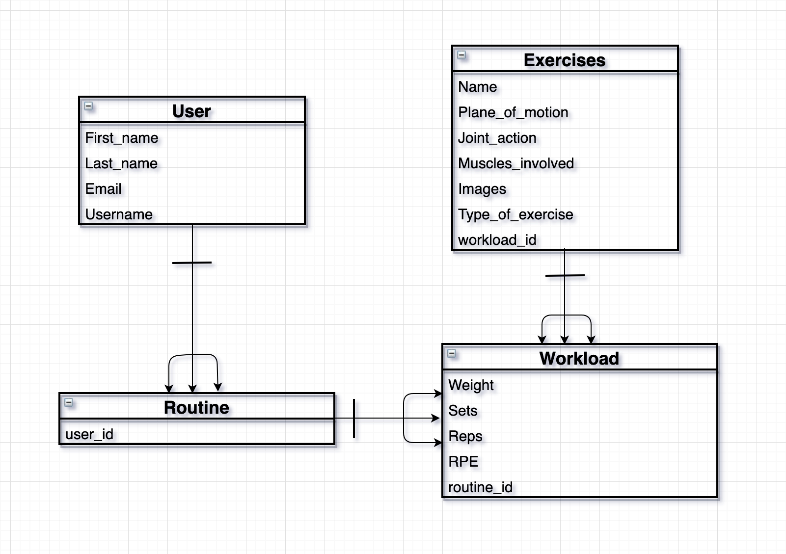

# Lifter's Paradise
A full stack application on logging exercises to track progression

## About the App
The purpose of this app is to look through a list of exercises that are available in the webpage and add any of them to your routine. When adding the exercise to the routine, the user must fill out the workload completed for the exercise, which includes the number of reps, sets, and weights he/she did. This way the user can keep track of the amount of work he/she did for the given exercise. 

In essence, this is an app in which user's log their workout. Other information will be provided such as a page on nutrition to further optimize the goals of the user if they want to learn more about health and fitness and continuously making progression. 


## Wireframes
### First Page of Wireframe
Sign-in & Sign-out Page             |  Description
:--------------------------:|:-------------------------:
   |  The landing page of the web application will display a login form. If the user knows his/her login credentials, he/she can move on to see the rest of the website. The only information required to login is the user's email and password. If the user types in the incorrect credentials, he/she will not be allowed to continue and an error message will be shown that either the password or email is incorrect. If the user does not have an account in the web application, he/she can sign up for one. The requirements to sign up for an account are, the first name, last name, email, password and maybe a confirmation password. Once the user fills out that form, the database will be updated with that information and the user will be redirected back to the landing page with the login form shown. The user can now fill in the login form with the information he/she inputted on the sign-up form. 

------------------------------------------------------------------------------------------------------------------------

### Second Page of Wireframe
Home Page             |  Description
:--------------------------:|:-------------------------:
   |  The home page is kept very simple and it's sole purpose is to let the user know what type of webpage this app is. It'll have an intro text of a very brief description of the web application and just below it is a button which will redirect the user to the routine's page. The routine's page will be described in more details in the routine wireframe below. There may also be a header above the navbar which will have a background image and a giant text that displays "Lifters Paradise" but that is optional. I may or may not keep it.

------------------------------------------------------------------------------------------------------------------------

### Third Page of Wireframe
Exercises and Nutrition Page             |  Description
:--------------------------:|:-------------------------:
   |  The exercises page will render the exercises and type of exercises from the database. Under each exercise type will include exercises that falls under the category. The exercises will include some information about it such as an image of the starting position of the exercise, another image of the ending position of the exercise, the name of it, the muscles involved or used, the plane of motion, and the joint-action. There is a button next to each exercise, which will allow the user to add that exercise to his/her routine. When the user clicks on the add button, a form will pop up and the user will enter some information, which will be described in more details in the routine page below. In the nutrition page, just like with the home page, this will be kept very simple. The page layout will look almost exactly like the home page for my P2 project on Nutri Gainz. This page will include a button below the intro header and that button will direct the user to the Nutri Gainz application.

------------------------------------------------------------------------------------------------------------------------

### Fourth Page of Wireframe
Routine Page             |  Description
:--------------------------:|:-------------------------:
   |  The routine page will have two different looks depending if the user added an exercise or not. If the user has not added an exercise, a simple text of "Bruh, do you even lift? There are no exercises listed" will be displayed and that will be all. If the user does add an exercise, a table will be added with the name of the exercise just above. The table will be separated by a row of different types of inputs, which includes, sets, reps, weights, rate of percieved exertion (RPE), and volume. Volume may be optional. Under the table, there will be three buttons, delete, update, and add. The delete will remove the last column of the table. the update will allow the user to update the information of all the information on the table. And the add will display a pop up form in which the user must enter the information for sets, reps, weights, and RPE. Once the user submits the form, that information will be added as a column in the table.

------------------------------------------------------------------------------------------------------------------------


## Entity Relationship Diagram (ERD)

Both the user and exercises will have a one to many relationship with Workload. So each users and exercises can have many Workload. The Workload will fill in the Create, Read, Update, and Delete (CRUD) functionalities. So for each exercise a user wants to add to his/her routine, he/she must fill out a form on how many sets, reps, and weights he/she did as well as input their RPE. That workload will be shown under the added exercise. The user can then decide wether to delete that workload, add another one, or update the current ones. 

### CRUD	
* CREATE - User will be able to create a workload
* READ - Users will be able to view all the workload, as well as exerices
* UPDATE - will be able to update a workload
* DELETE - will be able to delete a workload

------------------------------------------------------------------------------------------------------------------------

## Component Hierarchy Model

The component heirarchy starts off with the navbar and routes from the App.js. The navbar will remain on each page as different components render, which is why it is under the App.js. The routes significate the number of different links the webpage goes to. Under each links will be components, which will represent the outlook for that page. 

### MVP
* Meet CRUD functionality
* Incorporate auth
* Allow users to add exercises from exercise page
* Display user's workout routine
* Style to beautify webpage

### Post MVP
* Add confirm password when signing up for an account
* Add more style
* Make webpage responsive
* Allow users to add exercise
* Allow users to delete or update any added exercises
* Allow users to upload an image

## Technologies Used
- Rails
- React 
- PostgreSQL
- JavaScript
- HTML5
- CSS3

## Deployment
Link will be provided once project is completed: 

If however you fork and/or clone the repo, this is the process to run it:

*Must have rails installed in system*

**Must be done in the root folder:**
```
    rails db:create           
    rails db:seed             
    rails server  
```            

**Must be done in the client folder:**
```
    npm install axios
    npm start
```


